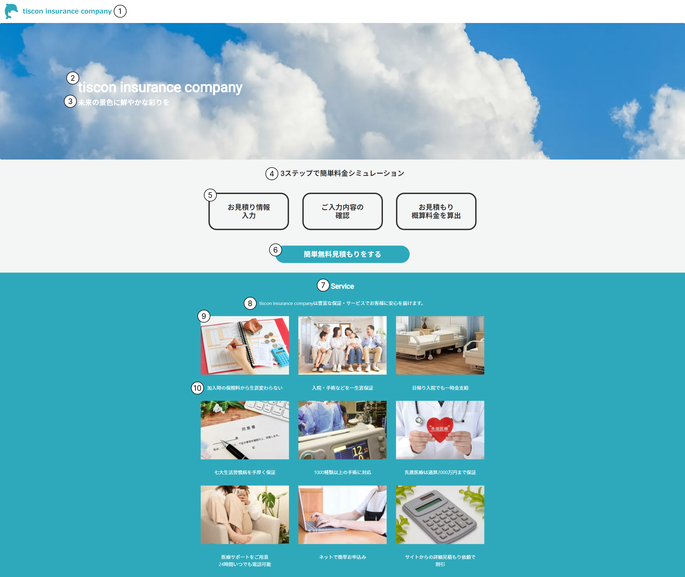

# TOP画面

## 概要

ランディングページ。

## 画面イメージ

## 画面項目定義

|No.|項目名|表示内容、情報の取得元|編集仕様、初期値、表示|
|--|--|--|--|
|1|ヘッダー|会社ロゴ画像を表示|固定表示|
|2|会社名|「ticon insurance company」と表示|-|
|3|ブランドメッセージ|「未来の景色に鮮やかな彩りを」と表示|-|
|4|見積もり案内 タイトル|「3ステップで簡単料金シミュレーション」と表示|-|
|5|見積もり案内 ステップ|表示内容は画面イメージを参照|-|
|6|見積もりボタン|「簡単無料見積もりをする」と表示|-|
|7|サービス案内 タイトル|「Service」と表示|-|
|8|サービス案内 サブタイトル|「tiscon insurance companyは豊富な保証・サービスでお客様に安心を届けます。」と表示|-|
|9|サービス案内 コンテンツ画像|画像を表示（表示内容は画面イメージを参照）|-|
|10|サービス案内 コンテンツ説明|サービス内容を表示(表示内容は画面イメージを参照)|-|

---

## 画面イベント一覧

|No.|オブジェクト|イベント|処理タイプ|処理|
|--|--|--|--|--|
|1|会社ロゴ（ヘッダー）|リンク押下|画面遷移|TOP画面に遷移|
|2|見積もりボタン |ボタン押下|画面遷移|入力画面に遷移|

--- 

## 処理詳細

### 1.会社ロゴ（ヘッダー）押下

1. TOP画面に遷移する。

### 2. 見積もりボタン押下

1. 入力画面に遷移する。
