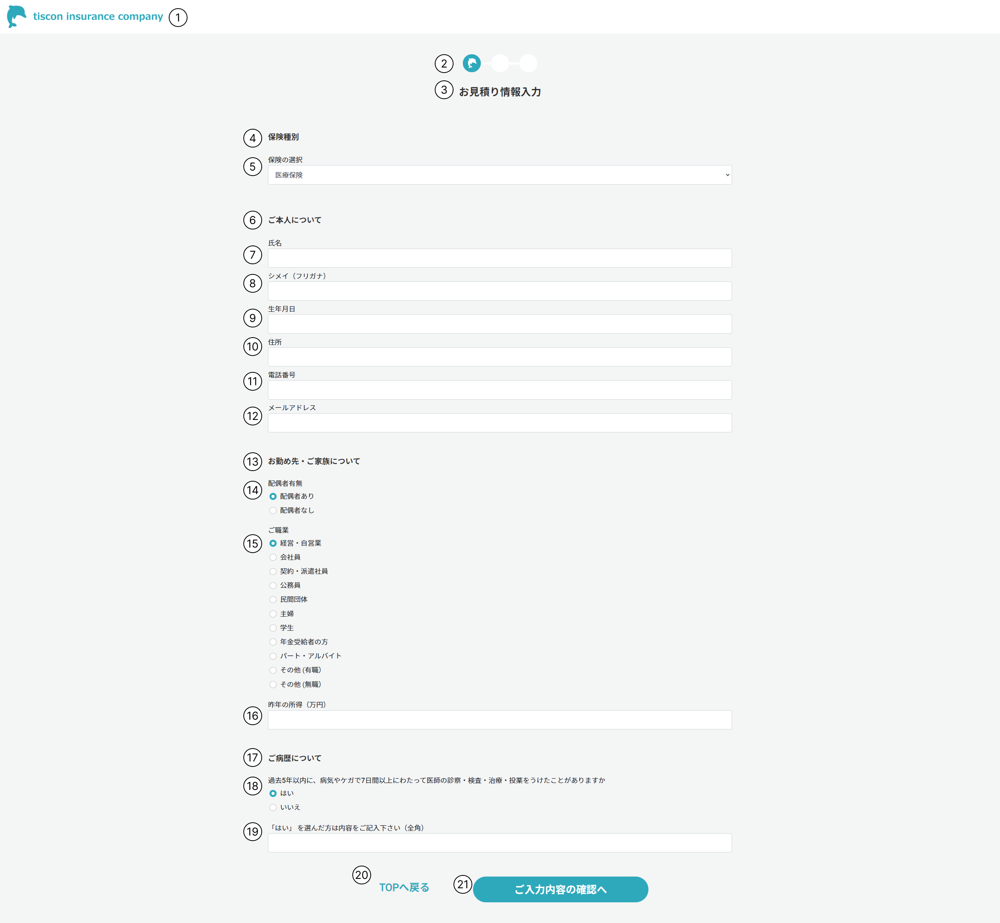

# 入力画面

## 概要

簡易見積もりに必要な入力を行う。

## 画面イメージ

## 画面項目定義

### ご本人について

|No.|項目名|入力方法|表示内容、情報の取得元|編集仕様、初期値、表示|
|--|--|--|--|--|
|1|ヘッダー|-|会社ロゴ画像を表示|固定表示|
|2|プログレスバー|-|画像を表示|-|
|3|お見積り情報入力|-|「お見積り情報入力」と表示|-|
|4|保険種別|-|「保険種別」と表示|-|
|5|保険の選択|プルダウン|「保険種別T.保険名」を選択肢に表示|保険種別.保険種別昇順で先頭のものを選択|
|6|ご本人について|-|「ご本人について」と表示|-|
|7|氏名|テキスト|-|-|
|8|シメイ（フリガナ）|テキスト|-|-|
|9|生年月日|テキスト|-|-|
|10|住所|テキスト|-|-|
|11|電話番号|テキスト|-|-|
|12|メールアドレス|テキスト|-|-|
|13|お勤め先・ご家族について|-|「お勤め先・ご家族について」と表示|-|
|14|配偶者有無|ラジオボタン|「配偶者有無.ラベル」を選択肢に表示|「配偶者あり」を選択|
|15|ご職業|ラジオボタン|「職業.ラベル」を選択肢に表示|「経営・自営業」を選択|
|16|昨年の所得|テキスト|-|-|
|17|ご病歴について|-|「ご病歴について」と表示|-|
|18|病歴有無|ラジオボタン|「病歴タイプ.ラベル」を選択肢に表示|「はい」を選択|
|19|病歴|テキスト|-|-|
|20|TOPへ戻るボタン|-|「TOPへ戻る」と表示|-|
|21|入力内容の確認ボタン|-|「ご入力内容の確認へ」と表示|-|

---

## 画面イベント一覧

|No.|オブジェクト|イベント|処理タイプ|処理|
|--|--|--|--|--|
|1|会社ロゴ（ヘッダー）|リンク押下|画面遷移|TOP画面に遷移|
|2|TOPへ戻るボタン|ボタン押下|画面遷移|TOP画面に遷移|
|3|入力内容の確認ボタン|ボタン押下|画面遷移|確認画面に遷移|

--- 

## 処理詳細

### 1. 会社ロゴ（ヘッダー）押下

1. TOP画面に遷移する。

### 2. TOPへ戻るボタン押下

1. TOPページに遷移する。入力値は保存しない。

### 3. 入力内容の確認ボタン押下

1. 確認画面に遷移する。ユーザーの入力値はinput type="hidden"で引き継ぐ。
