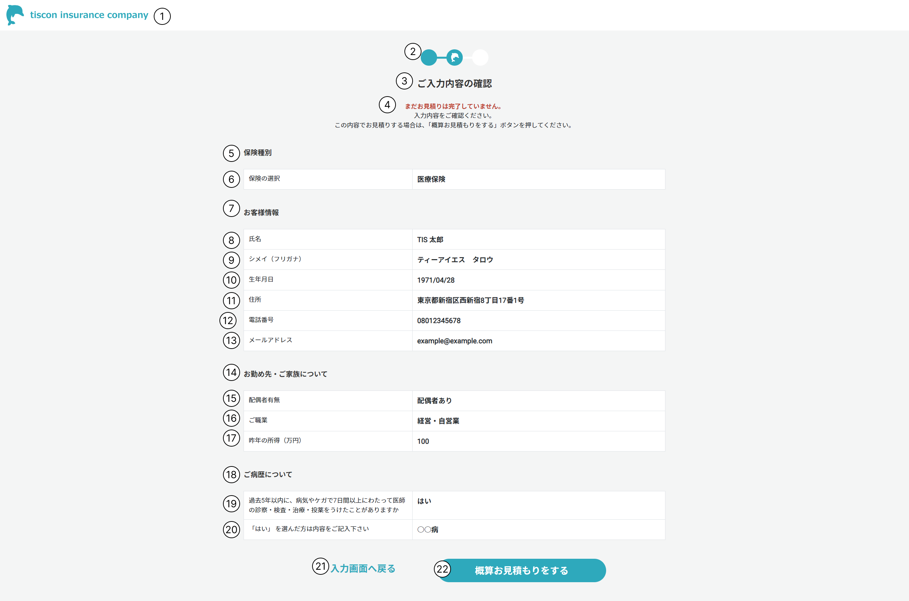

# 確認画面

## 概要

ユーザー入力内容を再表示し、確認を促す。

## 画面イメージ

## 画面項目定義

|No.|項目名|表示内容、情報の取得元|編集仕様、初期値、表示|
|--|--|--|--|
|1|ヘッダー|会社ロゴ画像を表示|固定表示|
|2|プログレスバー|画像を表示|-|
|3|ご入力内容の確認|「ご入力内容の確認」と表示|-|
|4|案内|表示内容は画面イメージ参照|-|
|5|保険種別|「保険種別」と表示|-|
|6|保険の選択|ユーザー入力|ユーザ入力から保険種別.保険名を取得|
|7|お客様情報|「お客様情報」と表示|-|
|8|氏名|ユーザー入力|-|
|9|シメイ（フリガナ）|ユーザー入力|-|
|10|生年月日|ユーザー入力|yyyy/MM/dd形式|
|11|住所|ユーザー入力|-|
|12|電話番号|ユーザー入力|-|
|13|メールアドレス|ユーザー入力|-|
|14|お勤め先・ご家族について|「お勤め先・ご家族について」と表示|-|
|15|配偶者有無|ユーザー入力|配偶者有無列挙型|
|16|ご職業|ユーザー入力|ご職業列挙型|
|17|昨年の所得|ユーザー入力|-|
|18|ご病歴について|「ご病歴について」と表示|-|
|19|病歴有無|ユーザー入力|病歴有無列挙型|
|20|病歴|ユーザー入力|-|
|21|入力画面へ戻るボタン|「入力画面へ戻る」と表示|-|
|22|概算見積りボタン|「概算お見積りをする」と表示|-|

---

## 画面イベント一覧

|No|オブジェクト|イベント|処理タイプ|処理|
|--|--|--|--|--|
|1|会社ロゴ（ヘッダー）|リンク押下|画面遷移|TOP画面に遷移|
|2|入力画面に戻るボタン|ボタン押下|画面遷移|入力画面に戻る|
|3|概算お見積りをするボタン|ボタン押下|画面遷移|結果画面に遷移|

---

## 処理詳細

### 1. 会社ロゴ（ヘッダー）押下

1. TOP画面に遷移する。

### 2. 入力画面に戻るボタン押下

1. 入力画面に遷移する。入力値を引き継ぐ。

### 3. 概算お見積りをするボタン押下

1. 入力項目チェック。
2. 概算保険料を計算する。
    1. 保険種別テーブルから、ユーザが選択した保険に合致する保険の保険料を取得する。
    2. ユーザーが入力した生年月日と現在日付から年齢を計算する。
    3. 年齢調整率テーブルから、ユーザーの年齢に合致する調整率を取得する。
    4. 月額保険×調整率×12で保険料（年額）を計算する。
3. 見積もり結果画面に遷移する。

### 項目制約

|No.|項目名|必須|入力チェック|
|--|--|--|--|
|1|保険の選択|○|数値（正の整数）|
|2|氏名|○|文字制限60文字|
|3|シメイ（フリガナ）|○|カタカナ、文字制限90文字|
|4|生年月日|○|日付|
|5|住所|○|文字制限255文字|
|6|電話番号|○|数値（正の整数）、文字制限13文字|
|7|メールアドレス|○|メールアドレス、文字制限255文字|
|8|配偶者有無|○|配偶者有無列挙型|
|9|ご職業|○|ご職業列挙型|
|10|昨年の所得|○|数値（正の整数）、文字制限9文字|
|11|病歴有無|○|病歴列挙型|
|12|病歴||相関（病歴ありの場合、必須）、文字制限120文字|
