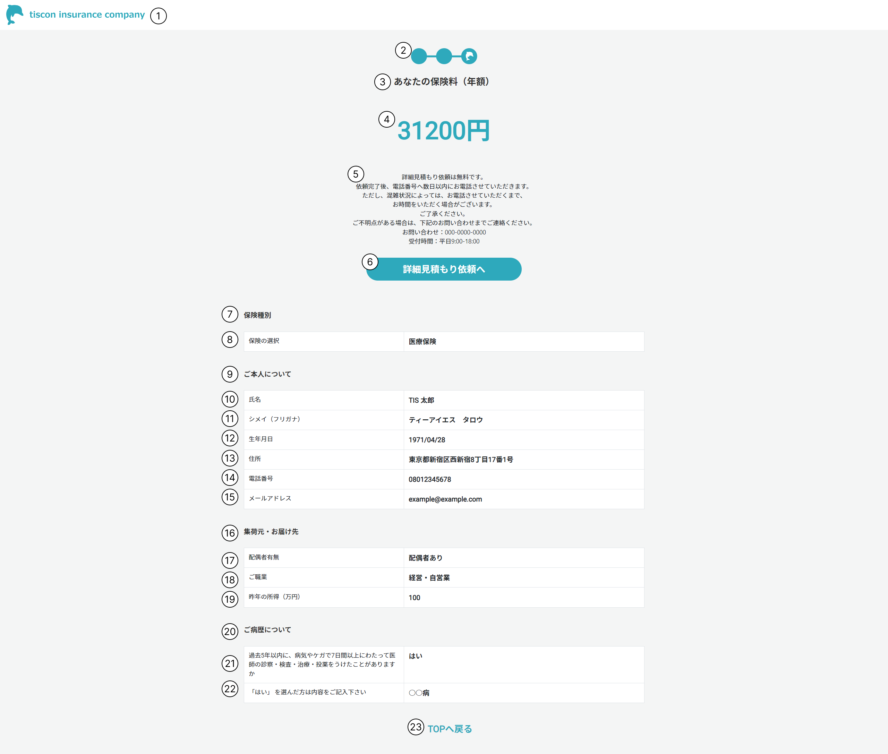

# 見積もり結果画面

## 概要

保険料の見積もり結果を表示し、詳細見積もりを促す。

## 画面イメージ

## 画面項目定義

|No.|項目名|表示内容、情報の取得元|編集仕様、初期値、表示|
|--|--|--|--|
|1|ヘッダー|会社ロゴ画像を表示|固定表示|
|2|プログレスバー|画像を表示|-|
|3|あなたの保険料（年額）|「あなたの保険料（年額）」と表示|-|
|4|保険料（年額）|入力値から算出|-|
|5|注意書き|表示内容は画面イメージ参照|-|
|6|詳細見積もり依頼へボタン|「詳細見積もり依頼へ」と表示|-|
|7|保険種別|「保険種別」と表示|-|
|8|保険の選択|ユーザー入力|ユーザ入力から保険種別.保険名を取得|
|9|お客様情報|「お客様情報」と表示|-|
|10|氏名|ユーザー入力|-|
|11|シメイ（フリガナ）|ユーザー入力|-|
|12|生年月日|ユーザー入力|yyyy/MM/dd形式|
|13|住所|ユーザー入力|-|
|14|電話番号|ユーザー入力|-|
|15|メールアドレス|ユーザー入力|-|
|16|お勤め先・ご家族について|「お勤め先・ご家族について」と表示|-|
|17|配偶者有無|ユーザー入力|配偶者有無列挙型|
|18|ご職業|ユーザー入力|ご職業列挙型|
|19|昨年の所得|ユーザー入力|-|
|20|ご病歴について|「ご病歴について」と表示|-|
|21|病歴有無|ユーザー入力|病歴有無列挙型|
|22|病歴|ユーザー入力|-|
|23|TOPへ戻るボタン|「TOPへ戻る」と表示|-|

---

## 画面イベント一覧

|No|オブジェクト|イベント|処理タイプ|処理|
|--|--|--|--|--|
|1|会社ロゴ（ヘッダー）|リンク押下|画面遷移|TOP画面に遷移|
|2|詳細見積もり依頼へボタン|ボタン押下|画面遷移|入力画面に遷移|
|3|TOPへ戻るボタン|ボタン押下|画面遷移|TOP画面に遷移|

---

## 処理詳細

### 1. 会社ロゴ（ヘッダー）押下

1. TOP画面に遷移する。

### 2. 詳細見積り依頼へボタン押下

1. 保険申し込みテーブルに入力データを登録する。
2. 完了画面に遷移する。

### 3. TOPへ戻るボタン押下

1. TOP画面に遷移する。
