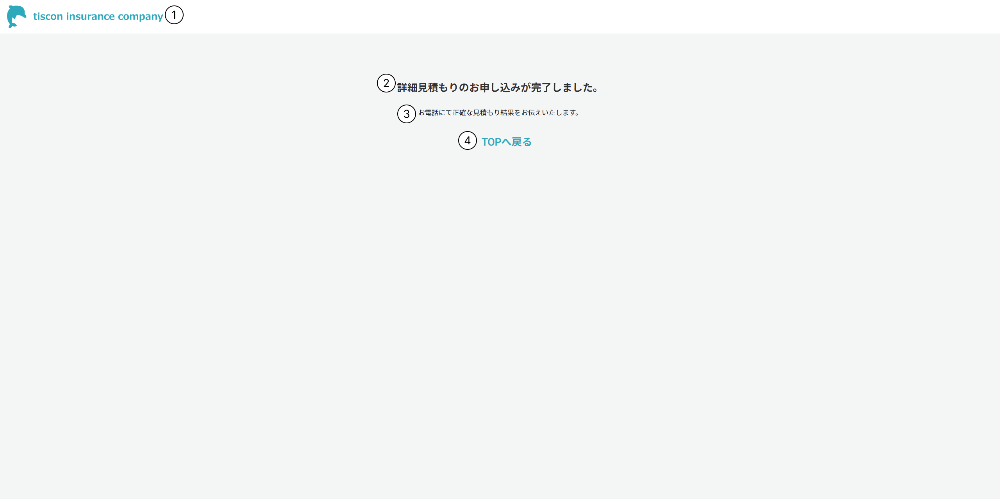

# 完了画面

## 概要

詳細見積もりの申し込み依頼が完了したことを伝える。

## 画面イメージ

## 画面項目定義

|No.|項目名|表示内容、情報の取得元|編集仕様、初期値、表示|
|--|--|--|--|
|1|ヘッダー|会社ロゴ画像を表示|固定表示|
|2|プログレスバー|画像を表示|-|
|3|申し込み完了メッセージ|「詳細見積もりのお申し込みが完了しました。」と表示|-|
|4|案内|「お電話にて正確な見積もり結果をお伝えいたします。」と表示|-|
|5|TOPへ戻るボタン|「TOPへ戻る」と表示|-|

---

## 画面イベント一覧

|No|オブジェクト|イベント|処理タイプ|処理|
|--|--|--|--|--|
|1|会社ロゴ（ヘッダー）|リンク押下|画面遷移|TOP画面に遷移|
|2|TOPへ戻るボタン|ボタン押下|画面遷移|TOP画面に遷移|

--- 

## 処理詳細

### 1. 会社ロゴ（ヘッダー）押下

1. TOP画面に遷移する。

### 2. TOPへ戻るボタン押下

1. TOP画面に遷移する。
