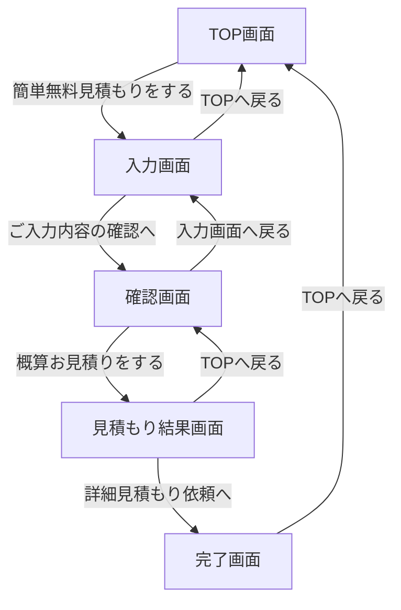
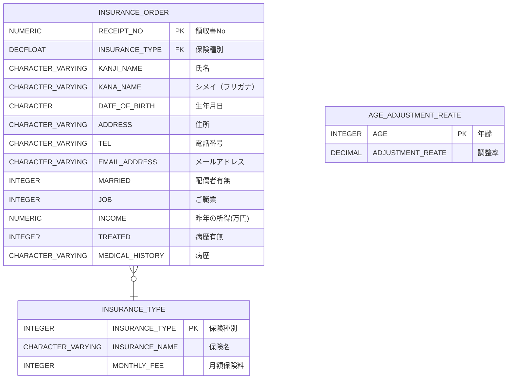

# 保険申し込みアプリケーション設計書
tiscon4の設計書です。

# 機能
保険申し込みアプリケーションの機能は次のとおりです。

- 保険の申し込みができる

# 画面遷移
画面遷移を次の図で示します。

※ 各画面、ヘッダーの会社ロゴを押下することでTOP画面に遷移する。

# ER図

# 画面設計
各画面の詳細設計のリンクは下記の通りです。

- [TOP画面](./1-TOP画面.md)
- [入力画面](./2-入力画面.md)
- [確認画面](./3-確認画面.md)
- [見積もり結果画面](./4-見積もり結果画面.md)
- [完了画面](./5-完了画面.md)